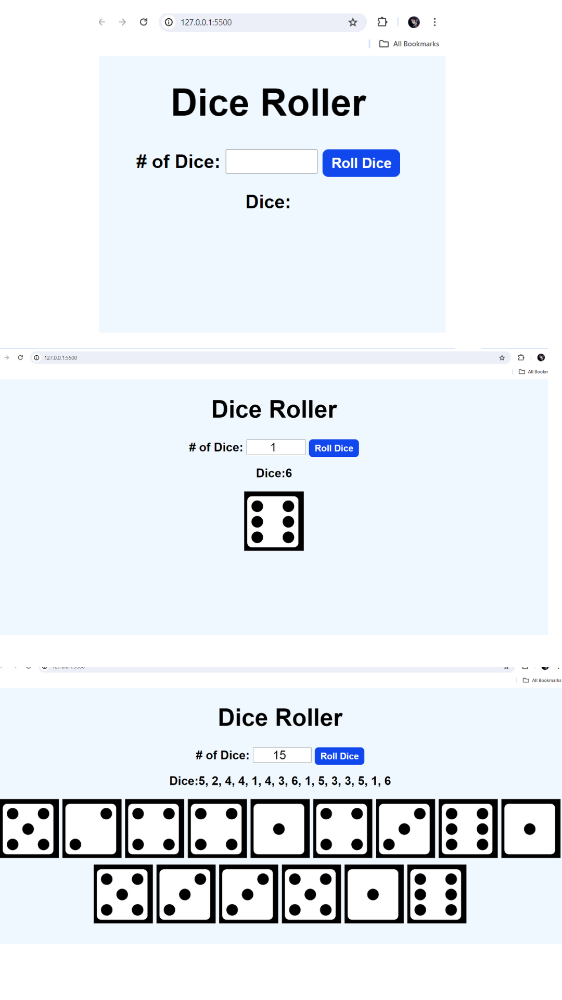
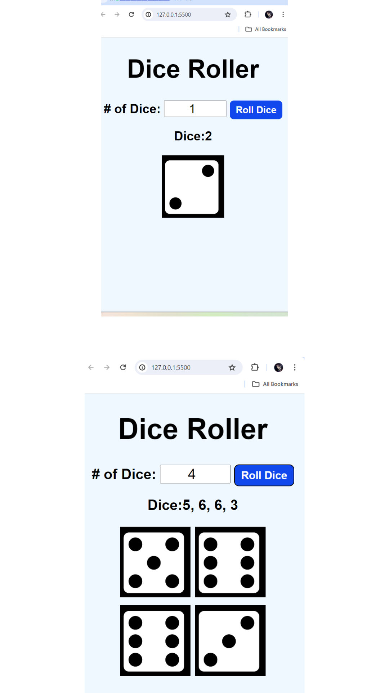

# Dice Roller 🎲


# Responsive view 🎲



# javascript code
```
function rollDice(){
    const numofDice=document.getElementById("numofDice").value;
    const diceResult=document.getElementById(`diceResult`);
    const diceImages=document.getElementById(`diceImages`);
    const values =[];
    const Images=[];

for(let i=0; i < numofDice; i++){
    const value=Math.floor(Math.random()*6)+1;
   values.push(value);
   Images.push(``);
}
diceResult.textContent=`Dice:${values.join(`, `)}`;
diceImages.innerHTML=Images.join(``);

}
```